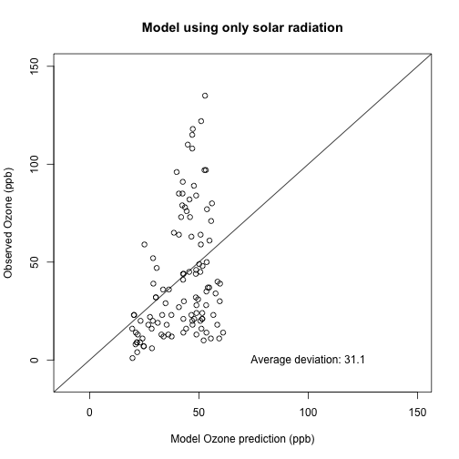
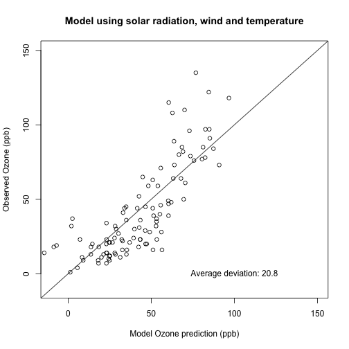

## Context

The quality of the outside air is vital to public health. Ozone is one of the metrics that influences the quality of the air.

- Need active monitoring of ozone
- Need additional weather metrics
- Need to build thrustworthy predictions for ozone levels
- Need public awereness of what influences air quality

--- .class #id 

## A shiny web application

A simple web application to demonstrate the weather influence on ozone levels:

https://sviaene.shinyapps.io/shiny/

- Data: New York Air Quality Measurements (standard R dataset)
- Possible input: Solar radiation, wind, temperature, month (i.e. seasonal variability)
- Model: A generalized linear model to predict Ozone from the chosen parameters
- Output: Model vs observations plot and average deviation

--- .class #id 

## Input

- Interactive checkbox to choose which parameters to use in the model
- Update model button to start/update the actual modelling

  

    <form class="well">
      

        

          <label>
            <input id="Solar.R" type="checkbox" checked="checked"/>
            Solar radiation
          </label>
        

      

      

        

          <label>
            <input id="Wind" type="checkbox"/>
            Wind
          </label>
        

      

      

        

          <label>
            <input id="Temp" type="checkbox"/>
            Temperature
          </label>
        

      

      

        

          <label>
            <input id="Month" type="checkbox"/>
            Month
          </label>
        

      

      <button id="update" type="button" class="btn btn-default action-button">Update model</button>
    </form>
  

  

--- &twocol w1:50% w2:50%
### Output examples
*** =left

*** =right

